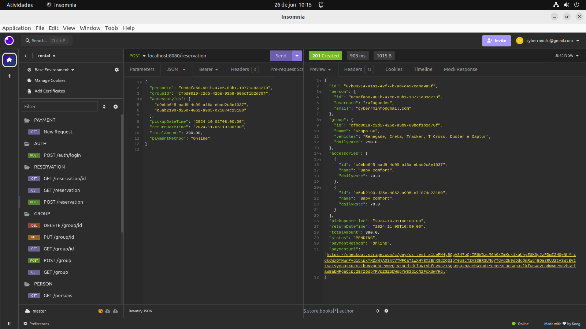
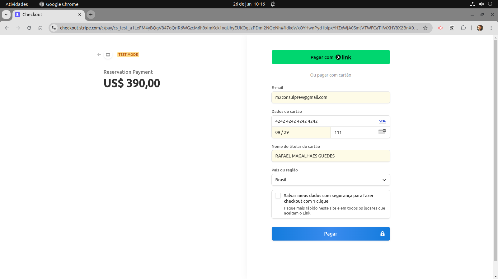
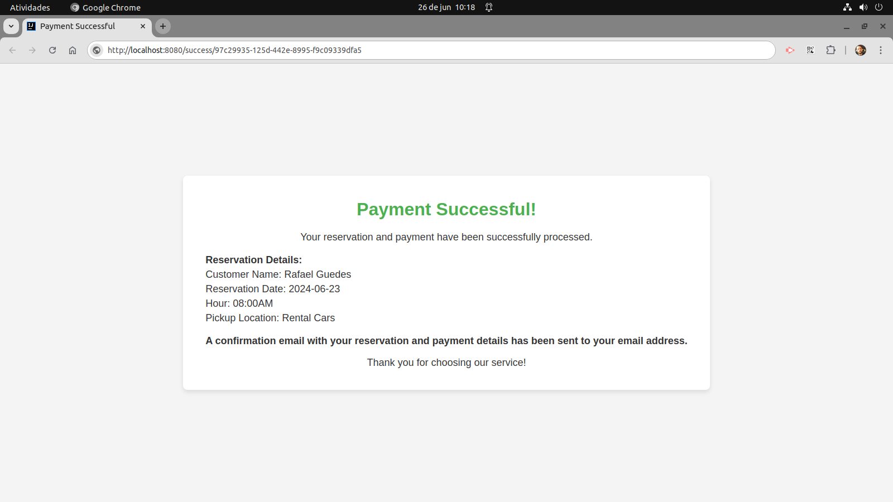

# Rental Service Application

Sistema para gerenciar clientes, reservas, aluguéis de acessórios e grupos de carros em uma locadora de veículos.
O sistema também inclui um microserviço para o envio de e-mails utilizando filas.

## Funcionalidades Principais

- Autenticação e Autorização: Autenticação de usuários e autorização baseada em papéis (ADMIN, MANAGER).

- Gerenciamento de Reservas: Registre e gerencie reservas de acessórios para pessoas ou grupos de veículos.

- Gerenciamento de Pessoas: Cadastre, liste, atualize e exclua informações de pessoas, incluindo clientes e funcionários.

- Gerenciamento de Acessórios: Cadastre, liste, atualize e exclua acessórios disponíveis para aluguel.

- Gerenciamento de Grupos de veículos: Crie, liste, atualize e exclua grupos de veículos.

- Integração com o Stripe: Permita que os usuários façam o pagamento das reservas utilizando cartão de crédito/débito através do Stripe.

## Microserviço de Envio de E-mails

O sistema inclui um microserviço para envio de e-mails, utilizando filas para processamento assíncrono
e garantir a entrega dos e-mails. O microserviço é responsável por:

- Envio de E-mails Assíncrono: Envio assíncrono de e-mails para evitar bloqueios durante a execução de outras tarefas.

- Tratamento de Falhas: Lidar com falhas de envio de e-mails de forma robusta e eficiente.

- Configuração com RabbitMQ: Utilização do RabbitMQ para gerenciamento de filas e garantia de entrega dos e-mails.

## Tecnologias Utilizadas

- Spring Boot: Framework para desenvolvimento de aplicativos Java.

- Spring Security: Gerenciamento de autenticação e autorização.

- Spring Data JPA: Acesso a dados utilizando o padrão JPA.

- Spring AMQP (RabbitMQ): Integração com RabbitMQ para envio de e-mails assíncronos.

- Hibernate Validator: Validação de entrada de dados.

- JavaMail Sender: Envio de e-mails utilizando o protocolo SMTP.

- Jakarta Validation: Validação de dados no lado do servidor.

- Stripe API: Integração com a API do Stripe para processamento de pagamentos.

## Configuração do Microserviço de E-mails

### Para configurar o microserviço de envio de e-mails, siga os passos abaixo:

- Configuração do RabbitMQ: Certifique-se de ter o RabbitMQ instalado e configurado corretamente.

- Configuração do Spring Boot: Edite o arquivo application.properties para configurar as propriedades do RabbitMQ, incluindo o host, porta, nome da fila, etc.

- Execução do Microserviço: Execute o aplicativo Spring Boot que contém o microserviço de envio de e-mails. Certifique-se de que o aplicativo esteja conectado ao RabbitMQ e pronto para processar as mensagens na fila.

## Integração com o Stripe

O sistema utiliza a tecnologia de integração de pagamentos Stripe para permitir que os usuários façam o pagamento das reservas de forma segura e conveniente. A integração com o Stripe inclui:

- Configuração da API do Stripe: Configuração das chaves de API do Stripe no sistema para autenticação e comunicação com o serviço.

- Implementação dos Endpoints de Pagamento: Desenvolvimento de endpoints no sistema para iniciar e processar transações de pagamento utilizando a API do Stripe.

- Segurança e Criptografia: Utilização de protocolos de segurança e criptografia para garantir a segurança das transações de pagamento e dos dados do usuário.

- Tratamento de Eventos: Implementação de mecanismos para lidar com eventos e notificações do Stripe, como confirmações de pagamento e atualizações de status.

### Endpoints Principais

#### Autenticação

- **Login:**
  - **POST /auth/login**
  - Request Body:
    ```json
    {
      "username": "user123",
      "password": "password123"
    }
    ```
  - Response:
    ```json
    {
      "token": "jwt-token"
    }
    ```

#### Usuários

- **Criar Usuário:**
  - **POST /persons**
  - Request Body:
    ```json
    {
      "username" : "user123",
      "email": "user@example.com",
      "password": "password123",
      "role": "USER"
    }
    ```
  - Response:
    ```json
    {
      "id": "uuid",
      "email": "user@example.com",
      "role": "USER"
    }
    ```

#### Reservas

- **Listar Reservas:**
  - **GET /reservations**
  - Query Parameters:
    - `pageNumber`: Número da página (padrão: 0)
    - `pageSize`: Tamanho da página (padrão: 10)
  - Response:
    ```json
    [
      {
        "id": "uuid",
        "person": {
          "id": "uuid",
          "email": "user@example.com"
        },
        "group": {
          "id": "uuid",
          "name": "Group Name"
        },
        "accessories": [
          {
            "id": "uuid",
            "name": "Accessory Name"
          }
        ],
        "pickupDateTime": "2023-06-01T10:00:00",
        "returnDateTime": "2023-06-10T10:00:00",
        "totalAmount": 100.0,
        "status": "CONFIRMED",
        "paymentMethod": "online",
        "paymentUrl": "http://payment.url"
      }
    ]
    ```

- **Criar Reserva:**
  - **POST /reservations**
  - Request Body:
    ```json
    {
      "personId": "uuid",
      "groupId": "uuid",
      "accessoryIds": ["uuid"],
      "pickupDateTime": "2023-06-01T10:00:00",
      "returnDateTime": "2023-06-10T10:00:00",
      "totalAmount": 100.0,
      "status": "PENDING",
      "paymentMethod": "online"
    }
    ```
  - Response:
    ```json
    {
      "id": "uuid",
      "person": {
        "id": "uuid",
        "email": "user@example.com"
      },
      "group": {
        "id": "uuid",
        "name": "Group Name"
      },
      "accessories": [
        {
          "id": "uuid",
          "name": "Accessory Name"
        }
      ],
      "pickupDateTime": "2023-06-01T10:00:00",
      "returnDateTime": "2023-06-10T10:00:00",
      "totalAmount": 100.0,
      "status": "PENDING",
      "paymentMethod": "online",
      "paymentUrl": "http://payment.url"
    }
    ```

## Screenshots

### Cria uma reserva com pagamento online



### Tela de pagamento Stripe



### Tela de succeso após o pagamento



### Tela de falha caso o cliente cancele o pagamento

