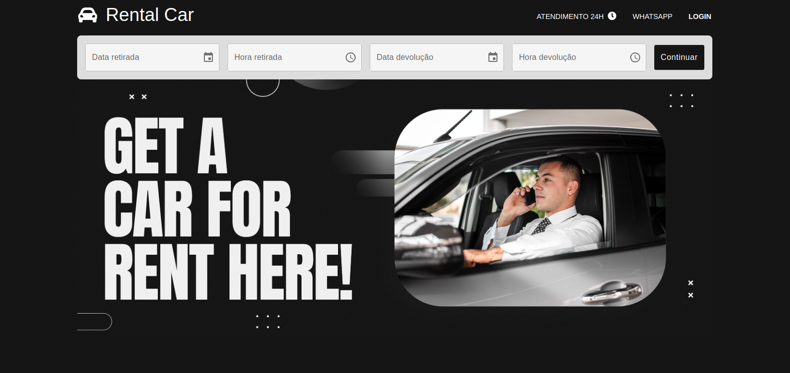

# Rental Car System - Full Stack Application

<div>
  
  
</div>
<br />



This project is a comprehensive full-stack application designed for a car rental service. It includes a robust API for managing clients, reservations, accessory rentals, and vehicle groups. The system integrates with the Stripe payment gateway to facilitate secure online transactions. Additionally, it features a microservices architecture to handle email communication efficiently, using message queues to ensure reliability and scalability.

## Technologies Used

### Back-end
- Spring Boot: Framework for developing Java applications.

- Spring AMQP (RabbitMQ): Integration with RabbitMQ for asynchronous email sending.

- JUnit 5: Unit and integration testing.

- Stripe API: Integration with the Stripe API for payment processing.

- SpringDoc OpenAPI: API documented with SpringDoc OpenAPI Swagger.

- NGINX: Web server and reverse proxy.

- Docker: Services use Docker containers for their lifecycle.

### Front-end
- NodeJS: JavaScript runtime environment for developing and running applications.
- ReactJS: Library for building dynamic and reactive user interfaces.
- TypeScript:  Programming language that adds static typing to JavaScript, improving code maintainability and scalability.
- Axios: Library for making HTTP requests, used for communication with APIs.

## Main Features
- Authentication and Authorization: User authentication and role-based authorization (ADMIN, MANAGER, and USER).

- Reservation Management: Register and manage accessory reservations for individuals or vehicle groups.

- Person Management: Create, list, update, and delete information about individuals, including clients and employees.

- Accessory Management: Create, list, update, and delete accessories available for rental.

- Vehicle Group Management: Create, list, update, and delete vehicle groups.

- Stripe Integration: Allows users to pay for reservations using credit/debit cards through Stripe.

## Email Sending Microservice
The system includes a microservice for sending emails, utilizing queues for asynchronous processing and ensuring email delivery. The microservice is responsible for:

- Asynchronous Email Sending: Sending emails asynchronously to avoid blocking during the execution of other tasks.

- Failure Handling: Robust and efficient handling of email sending failures.

- RabbitMQ Configuration: Using RabbitMQ for queue management and ensuring email delivery.

- Uses Cloud AMQP: Provides cloud-hosted messaging infrastructure, ensuring high availability, scalability, and performance for RabbitMQ queues.

## Installation

1. Clone the Repository
    ```
    git clone <repository-url>
    ```

2. Configure the environment variables in application-properties


3. Backend setup

    - Build and run Docker containers
    
    ```
    docker compose up -d
    ```
   
4. Frontend setup

    - cd /ms-frontend
   
    ```
    npm install
    npm run dev
    ```
   
## API Documentation
The API is documented using Swagger and can be accessed via SpringDoc OpenAPI.

## Contributing
Contributions are welcome! Please follow the contribution guidelines and submit pull requests for any changes or improvements.

## License
This project is licensed under the MIT License.
